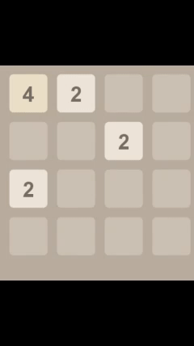
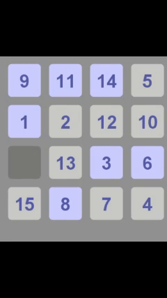

# Kotlin implementaion of Game2048 & Game of Fifteen

This repository contains Kotlin implementations of 2048 & Game of Fifteen featuring algorithmic logic (inversion count, merge mechanics), modular OOP design, and clean testable architecture. Built as part of the Final project for [Kotlin for Java Developers – JetBrains Academy](https://www.jetbrains.com/academy/)

- ✅ [2048](https://play2048.co/)
- ✅ [Game of Fifteen](https://15puzzle.netlify.app/)

Both games are built using the **Kotlin and the Java Swing**, following clean code principles with shared interfaces and reusable game board logic.

---

## 🧱 The core design is built around:
- A shared `Game` interface
- A reusable `GameBoard` interface
- Separate initializers and helpers for each game
- Functional programming with lambdas and generics

---

## 🧩 Game 2048

**2048** is a logic-based number merging game where the player moves tiles to combine identical numbers until reaching 2048.

### Features:
- Move tiles in four directions (up/down/left/right)
- Merge identical adjacent tiles
- New 2 or 4 tile added randomly after each move
- Game over when the board is full

### Screenshots:

---

## 🔢 Game of Fifteen

A sliding puzzle game where the player arranges numbers 1 to 15 by moving tiles into an empty space.  
Only even permutations of tiles are solvable — this check is implemented using the **inversion count algorithm**.
  
### Screenshots:

---

## ▶️ How to Run the Games

### Requirements:
- Kotlin (JVM)
- IntelliJ IDEA or compatible IDE

### Run 2048:
- Navigate to `ui/PlayGame2048.kt`
- **Run**  `main()`

### Run Game of Fifteen:
- Navigate to `ui/PlayGameOfFifteen.kt`
- **Run**  `main()`

